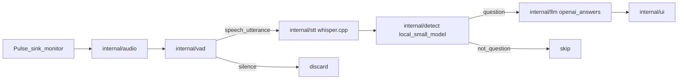

# meeting-sidecar

Private meeting assistant for Linux (GNOME/X11 + PipeWire). It listens to **meeting playback** (what your speakers/headphones play), transcribes speech with **local Whisper**, asks a **small local model** whether the utterance is a question, and only then requests a short suggested answer from **ChatGPT** (or Ollama). Suggestions appear in a separate always-on-top HUD you can keep on a non-shared monitor.

**Repository:** `git@github.com:Legion112/meeting-sidecar.git`  
**Module:** `github.com/Legion112/meeting-sidecar`  
**Language:** Go 1.27 (no Bash/Python in the project)

## Why this design

| Stage | Where | Why |
|---|---|---|
| Capture | Pulse/PipeWire **sink monitor** only | Meeting questions are in playback, not your mic. v1 has **no microphone** support. |
| VAD | Local Go | Silence is discarded and **never** reaches Whisper/LLM. |
| STT | Local Whisper (whisper.cpp) | Core transcription stays on-device. |
| Question gate | Small Ollama model | Cheap filter so ChatGPT is not called for every sentence. |
| Answers | OpenAI `gpt-5.6-luna` (default) or Ollama | Short, speakable cues only when something is a question. |
| UI | Fyne overlay | Private HUD; pin to a monitor you are not screen-sharing. |



## Privacy and screen sharing

On GNOME **X11**, there is no API to exclude a window from full-screen capture. Reliable approaches:

1. Share a **window** or **region**, not the entire display.
2. Put the HUD on a **second monitor** (`ui.display` is a placement hint; place the window yourself on the non-shared output).
3. Press **Hide** before sharing the whole screen.

Do not share the HUD window.

## Architecture

| Package | Role |
|---|---|
| `cmd/meeting-sidecar` | Pulse wiring + `main` |
| `internal/app` | Dependency assembly and lifecycle |
| `internal/config` | YAML config |
| `internal/audio` | Monitor resolution + PCM buffer (Pulse factory injected from `cmd`) |
| `internal/vad` | Mandatory energy VAD; silence never leaves |
| `internal/stt` | `Transcriber` interface |
| `internal/stt/whisper` | Client, model download, Engine interface |
| `internal/detect` | Ollama question gate + reply parsing |
| `internal/llm` | OpenAI + Ollama answer completers |
| `internal/ui` | HUD interface, MemoryHUD, FyneHUD |
| `internal/pipeline` | Goroutine pipeline |

## Requirements

- Go **1.27** (`toolchain go1.27.0` in `go.mod`; this machine: `/home/legion/sdk/go1.27.0/bin/go`)
- PipeWire with `pipewire-pulse` (Pulse compatibility)
- OpenGL/X11 headers for Fyne (`PKG_CONFIG_PATH=/usr/lib/x86_64-linux-gnu/pkgconfig`, packages providing `gl.pc`)
- [Ollama](https://ollama.com) with a small gate model, e.g. `qwen2.5:0.5b`
- `OPENAI_API_KEY` when `llm.provider: openai`
- **CUDA Whisper** (default STT): NVIDIA GPU + CUDA toolkit + whisper.cpp built with `GGML_CUDA=ON`

### One-time CUDA Whisper setup (this host)

Paths used here:

| Piece | Location |
|---|---|
| CUDA toolkit 13.0 | `~/sdk/cuda-13.0` (`nvcc` on `PATH`) |
| whisper.cpp | `~/sdk/whisper.cpp` |
| Static libs | `~/sdk/whisper.cpp/build_go/` (`libwhisper.a`, `libggml*.a`, `libggml-cuda.a`) |
| Model | `~/.local/share/meeting-sidecar/models/ggml-small.bin` (auto-downloaded on first run) |

Build whisper.cpp with GPU (not CPU-only):

```text
cmake -S . -B build_go \
  -DCMAKE_BUILD_TYPE=Release \
  -DBUILD_SHARED_LIBS=OFF \
  -DGGML_CUDA=ON \
  -DCMAKE_CUDA_COMPILER=$HOME/sdk/cuda-13.0/bin/nvcc
cmake --build build_go --target whisper -j"$(nproc)"
```

Shell env for `go build` / `go test` / `go run` (CGO link order matters; use `-extldflags` so `-lggml-cuda` follows `-lggml`):

```text
export PATH=$HOME/sdk/go1.27.0/bin:$HOME/sdk/cuda-13.0/bin:$PATH
export CUDA_PATH=$HOME/sdk/cuda-13.0
export CUDA_HOME=$HOME/sdk/cuda-13.0
export PKG_CONFIG_PATH=/usr/lib/x86_64-linux-gnu/pkgconfig
export C_INCLUDE_PATH=$HOME/sdk/whisper.cpp/include:$HOME/sdk/whisper.cpp/ggml/include
export LIBRARY_PATH=$HOME/sdk/whisper.cpp/build_go/src:$HOME/sdk/whisper.cpp/build_go/ggml/src:$HOME/sdk/whisper.cpp/build_go/ggml/src/ggml-cuda:$HOME/sdk/cuda-13.0/lib64:$HOME/sdk/cuda-13.0/targets/x86_64-linux/lib
export LD_LIBRARY_PATH=$HOME/sdk/cuda-13.0/lib64:$HOME/sdk/cuda-13.0/targets/x86_64-linux/lib:${LD_LIBRARY_PATH:-}
export CGO_ENABLED=1
```

## Configuration

Copy [`config.example.yaml`](config.example.yaml) to `config.yaml` (gitignored).

Important fields:

- `audio.monitor`: empty → `default_sink + ".monitor"`; `all` → every playback sink (mixed, hotplug rescan); or one explicit `.monitor` name (mics rejected)
- `stt.model_path`: empty → `~/.local/share/meeting-sidecar/models/ggml-small.bin`
- `detect.ollama.model`: small local classifier
- `llm.provider`: `openai` (default) or `ollama`
- `llm.openai.model`: default `gpt-5.6-luna`
- `assistant.system_prompt`: omit to use the baked-in short speakable-cue prompt

### Local-only (no OpenAI)

To run without an OpenAI API key, set answers to Ollama in `config.yaml`:

```yaml
llm:
  provider: ollama
  ollama:
    base_url: http://127.0.0.1:11434
    model: llama3.2
```

The question gate already uses Ollama (`detect.ollama.model`, default `qwen2.5:0.5b`). Pull both models once:

```text
ollama pull qwen2.5:0.5b
ollama pull llama3.2
```

No `OPENAI_API_KEY` is required for this setup.

## Run

Preferred (sets CUDA / whisper.cpp link env automatically; embeds CUDA rpath so `./meeting-sidecar` runs without `LD_LIBRARY_PATH`):

```text
make
./meeting-sidecar -config config.yaml
```

Or with the CUDA Whisper env above (add `-Wl,-rpath,...` if running the binary outside `make`):

```text
go build -ldflags "-extldflags '-Wl,-rpath,\$$HOME/sdk/cuda-13.0/lib64 -Wl,-rpath,\$$HOME/sdk/cuda-13.0/targets/x86_64-linux/lib -lggml-cuda -lcudart -lcublas -lcuda -lculibos'" \
  -o meeting-sidecar ./cmd/meeting-sidecar
./meeting-sidecar -config config.yaml
```

Confirm the binary is CUDA-linked (`ldd meeting-sidecar | grep -i cuda`) and that inference uses the GPU (`nvidia-smi` while transcribing).

## Tests and coverage

Unit tests use fakes and `httptest` — no live OpenAI, Ollama, Whisper weights, Pulse, or GPU required for `internal/...` (Whisper engine paths are covered with a fake `wpkg.Model`). The same CUDA link flags are required because native Whisper CGO always compiles:

```text
make test
# or:
go test ./internal/... -covermode=atomic -coverprofile=cover.out \
  -ldflags "-extldflags '-lggml-cuda -lcudart -lcublas -lcuda -lculibos'"
go tool cover -func=cover.out
```

Target: **100% statement coverage** of `internal/...` packages.

## PipeWire notes (this host)

List playback sinks and monitor source names:

```text
make list-monitors
# or: ./meeting-sidecar -list-monitors
```

To capture **all outputs** (speakers + Bluetooth headphones, including devices plugged in mid-meeting), set in `config.yaml`:

```yaml
audio:
  monitor: all
```

The app mixes every sink `.monitor` into one stream and rescans every ~2s for new sinks.

Default playback sink monitor looks like:

`alsa_output.pci-0000_34_00.4.iec958-stereo.monitor`

If you switch headphones, resolve the current default sink’s `.monitor` (empty `audio.monitor` does this at runtime).

## Out of scope (v1)

- Microphone capture
- Mic + meeting mix / virtual sinks
- Injecting audio into the call
- Wayland exclusive-capture APIs
- OpenAI Whisper-as-a-Service as primary STT

## License

See repository license when published; local development copy for personal use.
