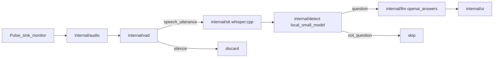

# meeting-sidecar

Private meeting assistant for Linux (GNOME/X11 + PipeWire). It listens to **meeting playback** (what your speakers/headphones play), transcribes speech with **local Whisper**, asks a **small local model** whether the utterance is a question, and only then requests a short suggested answer from **ChatGPT** (or Ollama). Suggestions appear in a separate always-on-top HUD you can keep on a non-shared monitor.

**Repository:** `git@github.com:Legion112/meeting-sidecar.git`  
**Module:** `github.com/Legion112/meeting-sidecar`  
**Language:** Go 1.27 (no Bash/Python in the project)

## Why this design

| Stage | Where | Why |
|---|---|---|
| Capture | Pulse/PipeWire **sink monitor** only | Meeting questions are in playback, not your mic. v1 has **no microphone** support. |
| VAD | Local Go | Silence is discarded and **never** reaches Whisper/LLM. |
| STT | Local Whisper (whisper.cpp) | Core transcription stays on-device. |
| Question gate | Small Ollama model | Cheap filter so ChatGPT is not called for every sentence. |
| Answers | OpenAI `gpt-5.6-luna` (default) or Ollama | Short, speakable cues only when something is a question. |
| UI | Fyne overlay | Private HUD; pin to a monitor you are not screen-sharing. |



## Privacy and screen sharing

On GNOME **X11**, there is no API to exclude a window from full-screen capture. Reliable approaches:

1. Share a **window** or **region**, not the entire display.
2. Put the HUD on a **second monitor** (`ui.display` is a placement hint; place the window yourself on the non-shared output).
3. Press **Hide** before sharing the whole screen.

Do not share the HUD window.

## Architecture

| Package | Role |
|---|---|
| `cmd/meeting-sidecar` | Pulse wiring + `main` |
| `internal/app` | Dependency assembly and lifecycle |
| `internal/config` | YAML config |
| `internal/audio` | Monitor resolution + PCM buffer (Pulse factory injected from `cmd`) |
| `internal/vad` | Mandatory energy VAD; silence never leaves |
| `internal/stt` | `Transcriber` interface |
| `internal/stt/whisper` | Client, model download, Engine interface |
| `internal/detect` | Ollama question gate + reply parsing |
| `internal/llm` | OpenAI + Ollama answer completers |
| `internal/ui` | HUD interface, MemoryHUD, FyneHUD |
| `internal/pipeline` | Goroutine pipeline |

## Requirements

- Go **1.27** (`toolchain go1.27.0` in `go.mod`; this machine: `/home/legion/sdk/go1.27.0/bin/go`)
- PipeWire with `pipewire-pulse` (Pulse compatibility)
- OpenGL/X11 headers for Fyne (`PKG_CONFIG_PATH=/usr/lib/x86_64-linux-gnu/pkgconfig`, packages providing `gl.pc`)
- [Ollama](https://ollama.com) with a small gate model, e.g. `qwen2.5:0.5b`
- `OPENAI_API_KEY` when `llm.provider: openai`
- For native Whisper: build with `-tags whisper` after compiling **libwhisper** from [whisper.cpp](https://github.com/ggerganov/whisper.cpp) and setting `C_INCLUDE_PATH` / `LIBRARY_PATH` (see whisper.cpp `bindings/go` README)

Without `-tags whisper`, the binary still builds; starting STT returns a clear error until Whisper is linked. Model download (ggml-small) is implemented in pure Go either way.

## Configuration

Copy [`config.example.yaml`](config.example.yaml) to `config.yaml` (gitignored).

Important fields:

- `audio.monitor`: empty → `default_sink + ".monitor"`; must end with `.monitor` (mics rejected)
- `stt.model_path`: empty → `~/.local/share/meeting-sidecar/models/ggml-small.bin`
- `detect.ollama.model`: small local classifier
- `llm.provider`: `openai` (default) or `ollama`
- `llm.openai.model`: default `gpt-5.6-luna`
- `assistant.system_prompt`: omit to use the baked-in short speakable-cue prompt

## Run

```text
export PKG_CONFIG_PATH=/usr/lib/x86_64-linux-gnu/pkgconfig
export PATH=/home/legion/sdk/go1.27.0/bin:$PATH
go run ./cmd/meeting-sidecar -config config.yaml
```

Or:

```text
go build -o meeting-sidecar ./cmd/meeting-sidecar
./meeting-sidecar -config config.yaml
```

With Whisper native engine:

```text
go build -tags whisper -o meeting-sidecar ./cmd/meeting-sidecar
```

## Tests and coverage

Unit tests use fakes and `httptest` — no live OpenAI, Ollama, Whisper weights, Pulse, or GPU required for `internal/...` (except optional download tests that hit a local `httptest` server).

```text
go test ./internal/... -covermode=atomic -coverprofile=cover.out
go tool cover -func=cover.out
```

Target: **100% statement coverage** of `internal/...` packages (Whisper CGO and upstream C are behind `-tags whisper` and are not part of the default coverage set).

## PipeWire notes (this host)

Default playback sink monitor looks like:

`alsa_output.pci-0000_34_00.4.iec958-stereo.monitor`

If you switch headphones, resolve the current default sink’s `.monitor` (empty `audio.monitor` does this at runtime).

## Out of scope (v1)

- Microphone capture
- Mic + meeting mix / virtual sinks
- Injecting audio into the call
- Wayland exclusive-capture APIs
- OpenAI Whisper-as-a-Service as primary STT

## License

See repository license when published; local development copy for personal use.
